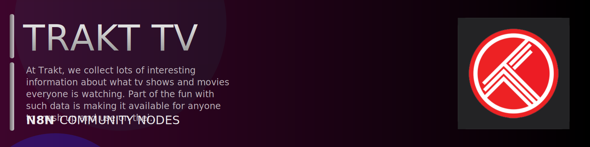

# @n8n-dev/n8n-nodes-trakt-tv



[](https://www.npmjs.com/package/@n8n-dev/n8n-nodes-trakt-tv)
[](https://opensource.org/licenses/MIT)

---

**Stop writing trakt-tv API integrations by hand.**

Every time you connect n8n to trakt-tv, you waste hours mapping endpoints, defining parameters, and debugging schemas. You copy-paste from docs, fix edge cases, and pray nothing breaks.

**What if connecting n8n to trakt-tv took 5 minutes, not half a day?**

This node gives you **21+ resources** out of the box: **Authentication O Auth**, **Authentication Devices**, **Calendars**, **Checkin**, **Certifications**, and 16 more: with full CRUD operations, typed parameters, and zero manual configuration.

---

## What You Get

- **Zero boilerplate**: Resources, operations, and fields are pre-configured and ready to use
- **Full CRUD**: Create, read, update, and delete support where the API allows it
- **Typed parameters**: No more guessing field types
- **Built-in auth**: API key authentication, ready to go
- **Declarative**: Native n8n performance, no custom execute() overhead

---

## Install

```bash
npm install @n8n-dev/n8n-nodes-trakt-tv
```

**Or in n8n:**
1. **Settings → Community Nodes → Install**
2. Search: `@n8n-dev/n8n-nodes-trakt-tv`
3. Click **Install**

---

## Quick Start

1. Install the node (above)
2. Add credentials: **trakt-tv API** → paste your API key
3. Drag the **trakt-tv** node into your workflow
4. Pick a resource → pick an operation → done.

That's it. No configuration files. No code. It just works.

---

## Resources

| Resource | Operations |
|----------|------------|
| Authentication O Auth | GET Authorize Application, POST Revoke an access_token, POST Exchange refresh_token for access_token |
| Authentication Devices | POST Generate new device codes, POST Poll for the access_token |
| Calendars | GET Get DVD releases, GET Get movies, GET Get new shows, GET Get season premieres, GET Get shows, GET Get DVD releases, GET Get movies, GET Get new shows, GET Get season premieres, GET Get shows |
| Checkin | DELETE Delete any active checkins, POST Check into an item |
| Certifications | GET Get certifications |
| Comments | POST Post a comment, GET Get recently created comments, GET Get trending comments, GET Get recently updated comments, DELETE Delete a comment or reply, GET Get a comment or reply, PUT Update a comment or reply, GET Get the attached media item, DELETE Remove like on a comment, POST Like a comment, GET Get all users who liked a comment, GET Get replies for a comment, POST Post a reply for a comment |
| Countries | GET Get countries |
| Genres | GET Get genres |
| Languages | GET Get languages |
| Lists | GET Get popular lists, GET Get trending lists, GET Get list, GET Get all list comments, GET Get items on a list, GET Get all users who liked a list |
| Movies | GET Get the most anticipated movies, GET Get the weekend box office, GET Get the most Collected movies, GET Get the most played movies, GET Get popular movies, GET Get the most recommended movies, GET Get trending movies, GET Get recently updated movie Trakt IDs, GET Get recently updated movies, GET Get the most watched movies, GET Get a movie, GET Get all movie aliases, GET Get all movie comments, GET Get lists containing this movie, GET Get all people for a movie, GET Get movie ratings, GET Get related movies, GET Get all movie releases, GET Get movie stats, GET Get movie studios, GET Get all movie translations, GET Get users watching right now |
| Networks | GET Get networks |
| People | GET Get recently updated people Trakt IDs, GET Get recently updated people, GET Get a single person, GET Get lists containing this person, GET Get movie credits, GET Get show credits |
| Recommendations | GET Get movie recommendations, DELETE Hide a movie recommendation, GET Get show recommendations, DELETE Hide a show recommendation |
| Scrobble | POST Pause watching in a media center, POST Start watching in a media center, POST Stop or finish watching in a media center |
| Search | GET Get ID lookup results, GET Get text query results |
| Shows | GET Get the most anticipated shows, GET Get the most collected shows, GET Get the most played shows, GET Get popular shows, GET Get the most recommended shows, GET Get trending shows, GET Get recently updated show Trakt IDs, GET Get recently updated shows, GET Get the most watched shows, GET Get a single show, GET Get all show aliases, GET Get all show certifications, GET Get all show comments, GET Get last episode, GET Get lists containing this show, GET Get next episode, GET Get all people for a show, GET Get show collection progress, GET Get show watched progress, DELETE Undo reset show progress, POST Reset show progress, GET Get show ratings, GET Get related shows, GET Get show stats, GET Get show studios, GET Get all show translations, GET Get users watching right now |
| Seasons | GET Get all seasons for a show, GET Get single season for a show, GET Get all season comments, GET Get lists containing this season, GET Get all people for a season, GET Get season ratings, GET Get season stats, GET Get all season translations, GET Get users watching right now |
| Episodes | GET Get a single episode for a show, GET Get all episode comments, GET Get lists containing this episode, GET Get all people for an episode, GET Get episode ratings, GET Get episode stats, GET Get all episode translations, GET Get users watching right now |
| Sync | POST Add items to collection, POST Remove items from collection, GET Get collection, POST Add items to watched history, POST Remove items from history, GET Get watched history, GET Get last activity, DELETE Remove a playback item, GET Get playback progress, POST Add new ratings, POST Remove ratings, GET Get ratings, POST Add items to personal recommendations, POST Remove items from personal recommendations, POST Reorder personally recommended items, GET Get personal recommendations, GET Get watched, POST Add items to watchlist, POST Remove items from watchlist, POST Reorder watchlist items, GET Get watchlist |
| Users | GET Get hidden items, POST Add hidden items, POST Remove hidden items, GET Get follow requests, GET Get pending following requests, DELETE Deny follow request, POST Approve follow request, GET Get saved filters, GET Retrieve settings, GET Get user profile, GET Get collection, GET Get comments, DELETE Unfollow this user, POST Follow this user, GET Get followers, GET Get following, GET Get friends, GET Get watched history, GET Get likes, GET Get a user's personal lists, POST Create personal list, GET Get all lists a user can collaborate on, POST Reorder a user's lists, DELETE Delete a user's personal list, GET Get personal list, PUT Update personal list, GET Get all list comments, POST Add items to personal list, POST Remove items from personal list, POST Reorder items on a list, GET Get items on a personal list, DELETE Remove like on a list, POST Like a list, GET Get all users who liked a list, GET Get ratings, GET Get personal recommendations, GET Get stats, GET Get watched, GET Get watching, GET Get watchlist |

---

## Why This Node?

**Without this node:**
- Hours of manual API integration
- Copy-pasting from trakt-tv docs
- Debugging auth, pagination, error handling
- Maintaining your own client code

**With this node:**
- Install → configure → use. 5 minutes.
- Auto-generated from the official trakt-tv OpenAPI spec
- Always up to date when the API changes
- Native n8n performance

---

## Auto-Generated
This node was auto-generated from the official **trakt-tv** OpenAPI specification using
[@n8n-dev/n8n-openapi-node-ultimate](https://github.com/kelvinzer0/n8n-openapi-node-ultimate),
then validated against the live API so you get accurate types and real parameters, not guesswork.

When the trakt-tv API updates, this node updates too.

---

## Support This Project

If this node saved you hours of work, consider supporting continued development, new APIs, better error handling, and faster updates.

[](https://n8n-code.github.io/membership/#/eyJ0aXRsZSI6IktlZXAgSXQgTW92aW5nIiwiZGVzYyI6Ik9uZSBkZXZlbG9wZXIgYnVpbHQgYSB0b29sIHRoYXQgYXV0by1nZW5lcmF0ZXNcbm44biBub2RlcyBmcm9tIGFueSBPcGVuQVBJIHNwZWMuXG5cbllvdXIgZG9uYXRpb24gZnVuZHMgbmV3IGZlYXR1cmVzLCBtb3JlIEFQSSBzdXBwb3J0LFxuYW5kIGJldHRlciB0b29saW5nIGZvciBldmVyeSBkZXZlbG9wZXIgYWZ0ZXIgeW91LiIsInRhcmdldCI6NTAwMCwiYWRkcmVzc2VzIjp7ImV0aGVyZXVtIjoiMHhmMDU1NWQ0MGRiRkI0ZTNCZjA3MDQ0MjgyQjc4RjJmRTFmNTFFZjcyIiwic29sYW5hIjoiNlpEVk5BYmpZZExEcXo4cGt3VUNHYllaNVV3QlFranB0QzU1Wk5vTFcybVUifSwiZGlzY29yZCI6Imh0dHBzOi8vZGlzY29yZC5nZy9wdERaOGU0aDkzIn0)

---

## License

MIT © [kelvinzer0](https://github.com/n8n-code)
